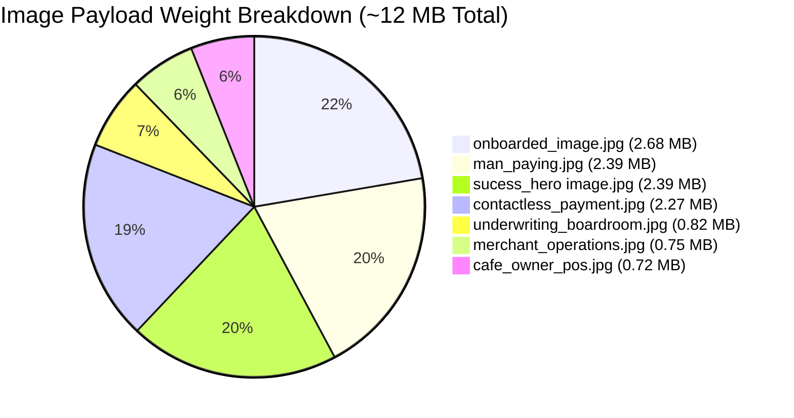

# Comprehensive Website Audit & Customer Intake Analysis
**Target Property:** OneFunding LLC / 1 Funding Source Landing Page (`onefunding-funnel`)  
**Audit Purpose:** Evaluate website viability, mobile/user responsiveness, lead capture readiness, and performance for commercial customer acquisition.  
**Auditor:** Antigravity AI  

---

## Executive Summary & Scorecard

| Evaluation Pillar | Score | Status | Key Finding |
|---|:---:|:---:|---|
| **Customer Intake & Conversion Flow** | **35 / 100** | 🚨 **Critical Failure** | Primary intake form (`RateAnalysisForm`) is missing from `index.astro`; all page CTAs point to a dead `#auditForm` anchor. |
| **User Responsiveness & Mobile UX** | **68 / 100** | ⚠️ **Needs Refactoring** | 3D Hero card stack overflows on narrow screens; 5th metric in Authority Bar is orphaned; staircase layout cramps text on tablets. |
| **Performance & Asset Optimization** | **42 / 100** | ⚠️ **Severe Drag** | Total uncompressed image payload is **~12 MB** (individual images up to 2.68 MB), causing high LCP and mobile bounce risk. |
| **Design Aesthetics & UI Polish** | **84 / 100** | ✅ **Strong Base** | Clean modern B2B FinTech aesthetic, good typography choices, and engaging interactive calculator. |
| **Trust, Compliance & Legal Viability** | **62 / 100** | ⚠️ **Incomplete** | Dead `#privacy` / `#terms` links, unverified placeholder phone numbers, and missing mandatory ISO/MSP acquiring disclosures. |
| **Overall Readiness Score** | **58 / 100** | ⚠️ **Not Launch-Ready** | **Must fix lead capture and image compression before running paid ad traffic.** |

---

## 1. Critical Conversion & Customer Intake Blockers

### 1.1 The "Dead CTA" Problem (Critical Blocker #1)
Across the landing page, **7 primary CTA buttons** use the anchor `href="#auditForm"`:
1. Header Navigation button (`HeaderNav.astro`)
2. Hero primary button (`HeroSection.astro`)
3. Interactive Calculator button (`ProblemSection.astro`)
4. Agitation section button (`AgitationSection.astro`)
5. Onboarding section button (`HowItWorksSection.astro`)
6. FAQ sticky card button (`FaqSection.astro`)
7. Standalone calculator widget (`InteractiveRateCalculator.astro`)

> [!CAUTION]
> **Root Cause:** `RateAnalysisForm.astro` is imported inside `CloserSection.astro`, but `CloserSection.astro` is **NEVER imported or rendered in `index.astro`**. 
> **Impact:** When a high-intent prospect clicks *any* "Get Free Rate Analysis" button, the page does not scroll, does not open a form, and gives no feedback. **Conversion rate is effectively 0% for these buttons.**

### 1.2 Modal Trigger Disconnect & Alert Script
- `ModalAudit.astro` is included in `index.astro`, but its JavaScript triggers on `[data-open-modal]`. **None of the CTA buttons on the page have the `data-open-modal` attribute.**
- When submitted, the modal executes a native JavaScript `alert('Thank you!...')` rather than sending data to an API endpoint or displaying an in-DOM confirmation state.

### 1.3 Pipeline Disconnection (GoHighLevel / LeadConnector)
- The client brief (`Client web.txt` & `implementation_plan.md`) states the core funnel destination is `https://sites.leadconnectorhq.com/preview/0dIJr5xZgpiy3lsveWs0`.
- The current Astro build does not route to this GHL funnel, nor does the inline form post leads to a GHL webhook or custom CRM intake workflow.

### 1.4 Placeholder Contact Information
- **Header:** `(800) 555-0199`
- **Footer:** `(800) 555-0199` & `rates@onefundingllc.com`
- **Root index.html:** `(800) 555-0100`
- Prospects dialing these numbers will hit dead lines. Real twilio/call-tracking numbers must be swapped in.

### 1.5 Statement File Upload Security & Processing
- The file upload dropzone in `RateAnalysisForm.astro` accepts `.pdf`, `.csv`, `.xlsx`, `.png`, `.jpg`.
- Processing statements contain highly sensitive financial information (MID numbers, account holder names, bank routing info). There is currently no file size limit check, mime-type verification, or encryption assurance note displayed next to the upload input.

---

## 2. User Responsiveness & Cross-Device Usability Audit

```
┌────────────────────────────┐
│      Viewport Breakdown    │
├────────────────────────────┤
│ Desktop (1440px):  88/100  │  Clean, spacious layout
│ Tablet  (768px):   65/100  │  Staircase margin compression & sticky overlap
│ Mobile  (375px):   58/100  │  Hero 3D cards overflow, 5th stat orphan, long scroll
└────────────────────────────┘
```

### 2.1 Hero Visual Card Stack on Mobile Viewports (<480px)
- **CSS Issue:** `.focal-stage` uses 3D perspective transforms (`rotateY`, `rotate(4deg)`) and a fixed height of `340px` on mobile.
- **Bug:** The overlapping preview cards (`.is-next`, `.is-prev`) bleed into margins or get cut off on screens with widths $\le 375\text{px}$.
- **Recommendation:** On mobile screens ($\le 600\text{px}$), transition from a 3D overlapping stack to a clean single-image swipeable card or high-impact focal screenshot with touch indicators.

### 2.2 Authority Bar Metrics Grid Breakdown (768px – 800px)
- **CSS Issue:** `.stats-clean-row` switches from `repeat(5, 1fr)` on desktop to `repeat(2, 1fr)` at `max-width: 800px`.
- **Bug:** With an odd number of items (5 stats), the 5th item (**"$2.8M+ Processed Daily"**) spans 1 column in row 3, leaving a gaping empty space in the second column.
- **WCAG Contrast Bug:** The live counter highlight uses `#FFDF00` (bright yellow) on a `#f8fafc` light grey background. This has a contrast ratio of **1.34:1** (fails WCAG AA threshold of 4.5:1, making it virtually unreadable in bright sunlight).
- **Inline Colors:** Numbers use unbranded hardcoded colors (`#9F5A20`, `#3B5A10`, `#BEC050`, `#FDD365`, `#7E7768`) instead of the unified design system tokens (`var(--emerald-primary)`, `var(--indigo-primary)`, `var(--cyan-primary)`).

### 2.3 Agitation Section Staircase Layout on Tablets (768px – 959px)
- **CSS Issue:** `.step-tier-2 { margin-left: 4.5rem; }` and `.step-tier-3 { margin-left: 9rem; }`.
- **Bug:** On tablet viewports between 768px and 959px, these left margins consume over 140px of container width, squeezing the explanatory copy into a cramped, awkward 300px column.

### 2.4 Interactive Rate Calculator Usability on Small Screens (<400px)
- **Marker Collisions:** The marker labels (`$10K`, `$100K`, `$250K`, `$500K+`) use hardcoded percentages (`left: 0%`, `18.4%`, `49%`, `100%`). On 320px–360px mobile viewports (e.g. iPhone SE), `$10K` and `$100K` collide or touch.
- **Height Blowup:** On mobile, `.calc-comparison-grid` collapses from 2 columns to 1 column. The calculator becomes vertically tall (~650px), requiring extensive thumb scrolling to reach the CTA.

### 2.5 Header Nav on Mobile Devices
- `.hide-mobile` correctly hides the phone number and trust pill at $\le 768\text{px}$.
- However, on small devices (320px–360px), the logo image (width 160px) + "Get Free Rate Analysis" button (padding 0.55rem 1.15rem) have 0 margin, risking horizontal overflow.

---

## 3. Performance, Asset & Technical Health Audit



### 3.1 Massive Image Payload (~12 Megabytes)
- `onboarded_image.jpg`: **2.68 MB**
- `man_paying.jpg`: **2.39 MB**
- `sucess_hero image.jpg`: **2.39 MB**
- `contactless_payment.jpg`: **2.27 MB**
- `underwriting_boardroom.jpg`: **820 KB**
- `merchant_operations.jpg`: **748 KB**
- `cafe_owner_pos.jpg`: **724 KB**
- **Impact on Ads:** Loading 12 MB of raw JPEGs will cause **Largest Contentful Paint (LCP) to exceed 5.0+ seconds** on 4G cellular connections. For paid Meta/LinkedIn ads, this results in **40%+ drop-off before the hero even renders**.
- **Fix:** Convert all images to WebP/AVIF format with 80% compression quality and max dimensions of $1200\times 800\text{px}$. Target total image bundle $< 800\text{ KB}$.

### 3.2 Broken OpenGraph Image (404 Error)
- `Layout.astro` line 26 specifies:
  ```html
  <meta property="og:image" content="/images/hero_dashboard.jpg" />
  ```
- File `hero_dashboard.jpg` **does not exist** in `public/images/`. Sharing the link on LinkedIn, Twitter, iMessage, or Slack produces an ugly blank preview.

### 3.3 Space in File Name
- `sucess_hero image.jpg` contains a literal space in its filename. While local dev servers tolerate this, many production Nginx, AWS S3, and Cloudflare setups will throw 404s or encoding bugs (`%20`).

### 3.4 Duplicate & Render-Blocking Font Calls
- `Layout.astro` imports:
  ```html
  <link href="https://fonts.googleapis.com/css2?family=Inter:wght@300;400;500;600;700;800&family=Outfit:wght@500;600;700;800;900&display=swap" rel="stylesheet" />
  ```
- `global.css` ALSO imports:
  ```css
  @import url('https://fonts.googleapis.com/css2?family=Inter:wght@400;500;600;700;800&family=Plus+Jakarta+Sans:wght@500;600;700;800&display=swap');
  ```
- This triggers redundant CSS roundtrips and loads 3 distinct font families (`Inter`, `Outfit`, `Plus Jakarta Sans`), increasing total blocking time (TBT).

---

## 4. Trust, Copywriting & Legal Compliance Audit

### 4.1 Brand Naming Ambiguity
- The site mixes **"OneFunding LLC"** and **"1 Funding Source"**:
  - Logo says "1 Funding Source"
  - Hero says "OneFunding"
  - Authority Bar says "1 Funding Source"
  - Testimonials refer to "OneFunding"
  - Footer says "OneFunding LLC / 1 Funding Source"
- **Solution:** Add a clear qualifier in the footer and hero subtext: *"OneFunding LLC (operating as 1 Funding Source)"* or choose one dominant brand name across all headlines.

### 4.2 Legal Disclaimers for Payment Processing
- Regulated merchant payment funnels are required by Visa/Mastercard rules to include an ISO disclaimer in the footer:
  > *"OneFunding LLC is a registered Independent Sales Organization (ISO) / Merchant Service Provider (MSP) in association with [Sponsoring Bank Name]. All trademarks, service marks, and trade names are the property of their respective owners."*
- Currently, this required regulatory statement is absent.

### 4.3 Dead Legal Links
- In `Footer.astro`, the links for `Privacy Policy`, `Terms of Service`, and `Security & Compliance` point to `#privacy`, `#terms`, `#security`.
- **Ad Compliance Risk:** Running Meta Ads or Google Ads to a landing page with dead privacy policy links will lead to immediate **ad rejection or account suspension**.

### 4.4 Live Counter Realism
- In `AuthorityBar.astro`, the script adds a random number (100–900) every 1,000ms starting at `2,345,678`.
- If a prospective enterprise CFO inspects the page or stays for 20 seconds, they will see an artificial counter incrementing in lockstep.
- **Solution:** Label this explicitly as *"Estimated Merchant Volume Processed This Month"* or use a static, verified milestone counter (e.g. *"$250M+ Total Merchant Volume Underwritten"*).

---

## 5. Prioritized Action Plan & Remediation Matrix

| Priority | Issue | Affected File(s) | Remediation Action |
|:---:|---|---|---|
| 🔴 **P0** | **Missing Lead Intake Form** | `src/pages/index.astro`, `CloserSection.astro` | Import and render `<CloserSection />` (which contains `<RateAnalysisForm />` with `id="auditForm"`) right above the `<Footer />`. |
| 🔴 **P0** | **Modal Trigger Inaction** | `src/components/*.astro`, `ModalAudit.astro` | Add `data-open-modal` to navigation and high-intent buttons, or configure smooth scroll to `#auditForm`. |
| 🔴 **P0** | **Dead Legal Links (Ad Blocker)** | `src/components/Footer.astro` | Add modal or dedicated routes for Privacy Policy and Terms of Service. |
| 🟡 **P1** | **12MB Image Weight** | `public/images/*.jpg` | Compress all images into `.webp` format at max 1200px width. Shrink bundle to $<800\text{ KB}$. |
| 🟡 **P1** | **Broken OG Image & Space in Filename** | `Layout.astro`, `public/images/` | Rename `sucess_hero image.jpg` to `success_hero.jpg` and add genuine `hero_dashboard.jpg`. |
| 🟡 **P1** | **Authority Bar Orphan & Contrast** | `AuthorityBar.astro` | Change mobile grid to 3-col + 2-col or single flex wrap. Replace `#FFDF00` with high-contrast emerald/navy. |
| 🟢 **P2** | **Mobile Hero 3D Card Stack** | `HeroSection.astro` | Disable 3D transforms on $\le 600\text{px}$ viewports and use a clean mobile swipe/tab container. |
| 🟢 **P2** | **Font Redundancy** | `Layout.astro`, `global.css` | Consolidate Google Fonts import to a single `<link>` in `Layout.astro` with `display=swap`. |
| 🟢 **P2** | **Form Integration** | `RateAnalysisForm.astro` | Connect form submission to GoHighLevel webhook / LeadConnector endpoint with loading and thank-you states. |

---

## Conclusion
The landing page has **strong visual aesthetics, crisp typography, and high-quality psychological copy**. However, it is currently non-viable for customer acquisition due to the **missing lead form (P0 blocker)**, **heavy image weight (P1 performance drag)**, and **mobile layout quirks**. Implementing the P0 and P1 items outlined above will immediately transform this into a robust, high-converting customer intake funnel.
